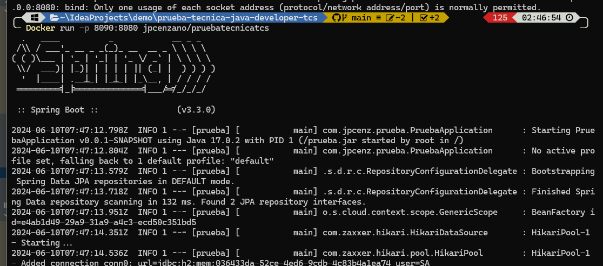
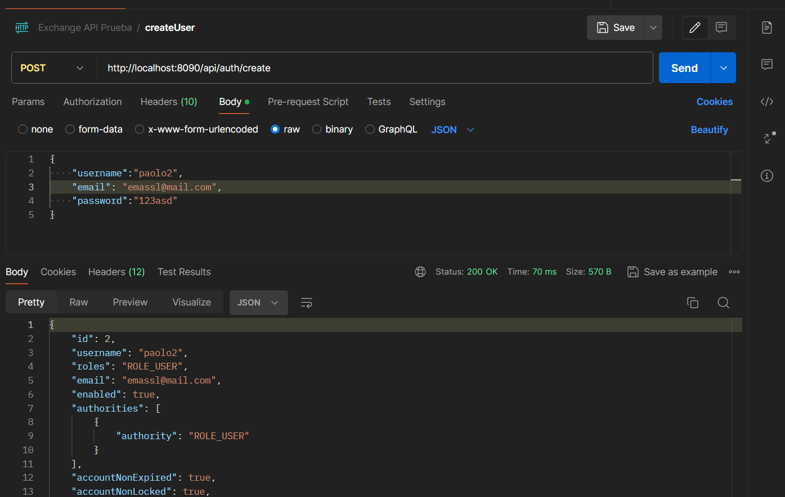
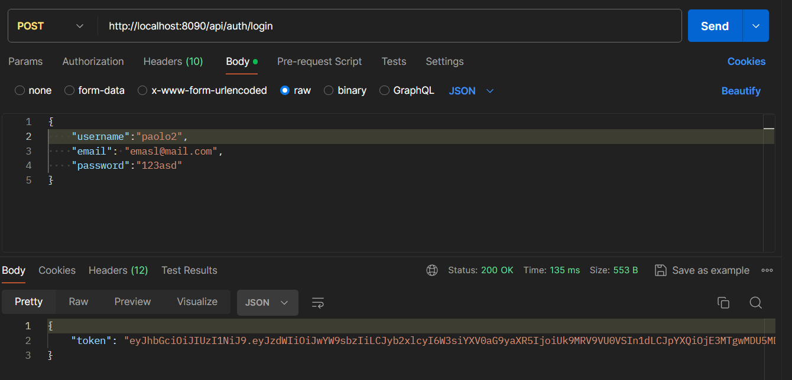
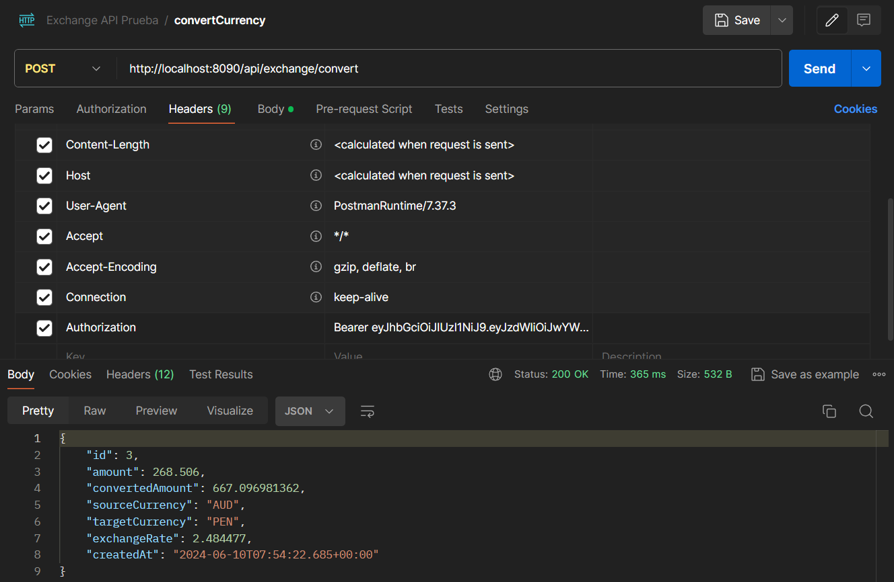
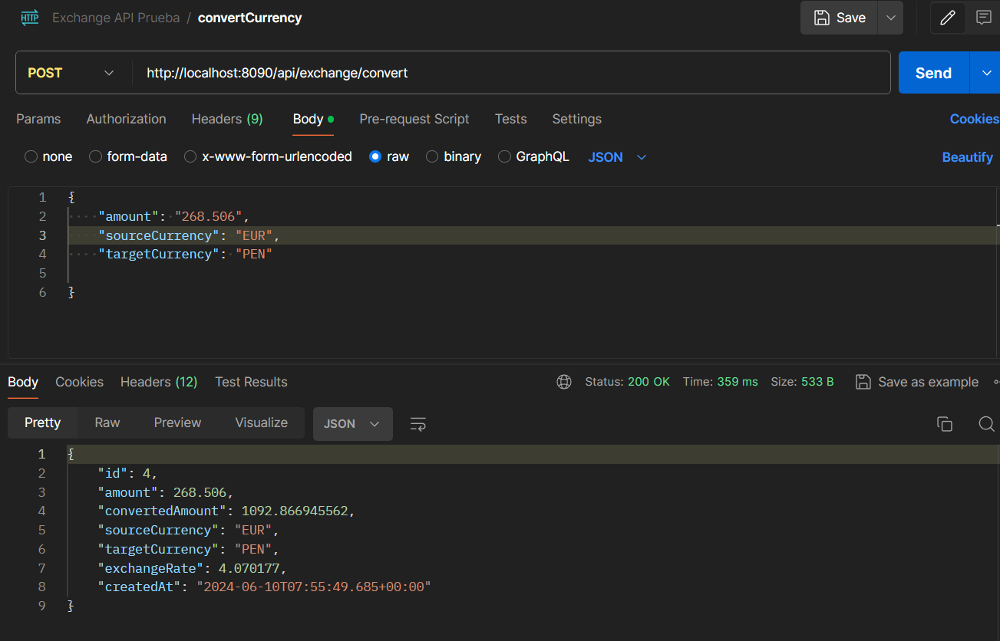
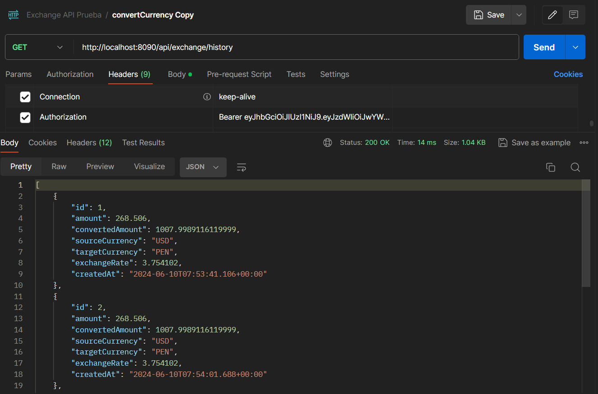
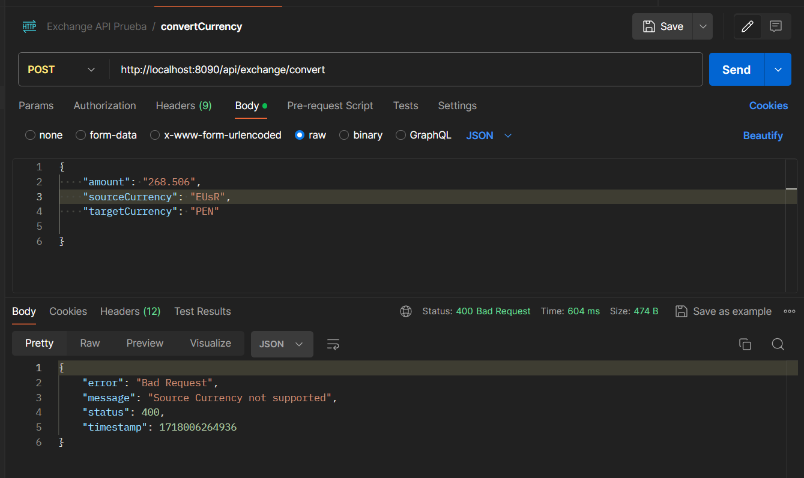
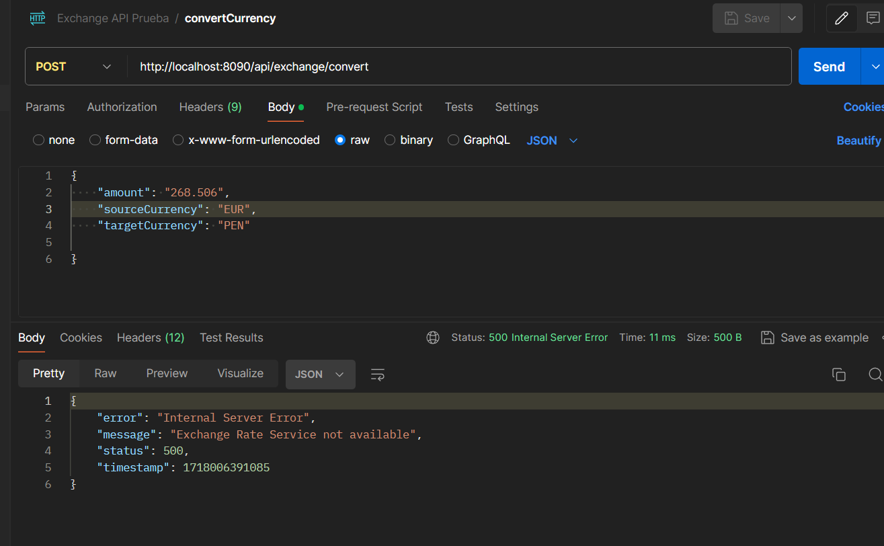

## README
### Proyecto para prueba tecnica
Author Jaime Cenzano (JPCenz)
#### Tecnologias
- JDK 17
- Spring Boot 3.3.0
- Maven 
- H2 Database
- Docker
- WebFlux

#### Instrucciones
1. Descargar la imagen de docker
```shell 
Docker pull jpcenzano/pruebatecnicatcs:latest
```
2. Ejecutar la imagen(escoger el puerto que desee exponer)
```shell
Docker run -p 8080:8080 jpcenzano/pruebatecnicatcs:latest
```


3. Crear un usuario
```shell
http://localhost:8080/api/auth/create
```



4. Iniciar sesion para generar token
```shell
http://localhost:8080/api/auth/login
```


5. Consumir los servicios
```shell
POST http://localhost:8080/api/exchange/convert
GET http://localhost:8080/api/exchange/history
```
Colocar el Authorization en el header con el token generado


6. Pruebas de los servicios

Convertir moneda


Listar Registros


Manejo de Errores


